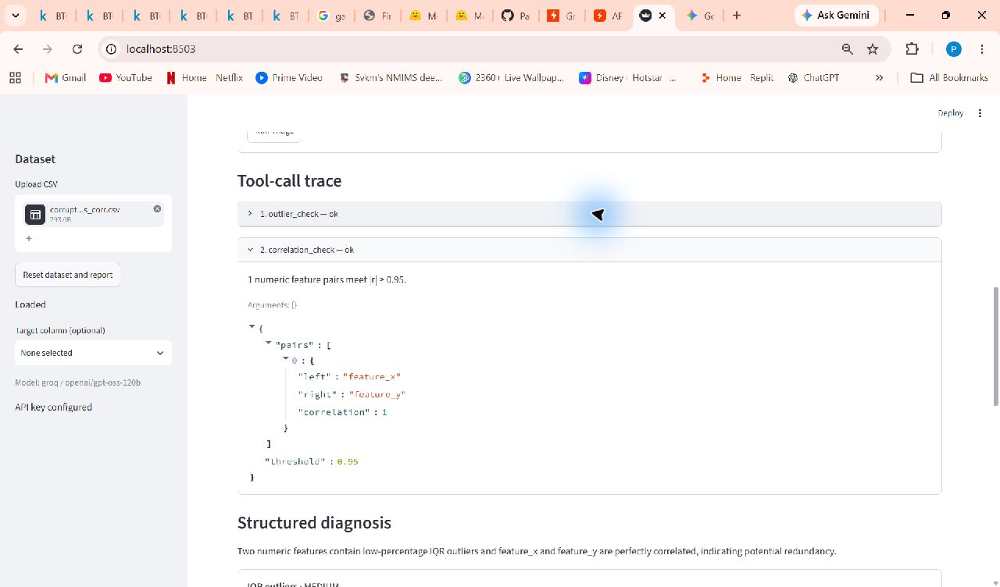
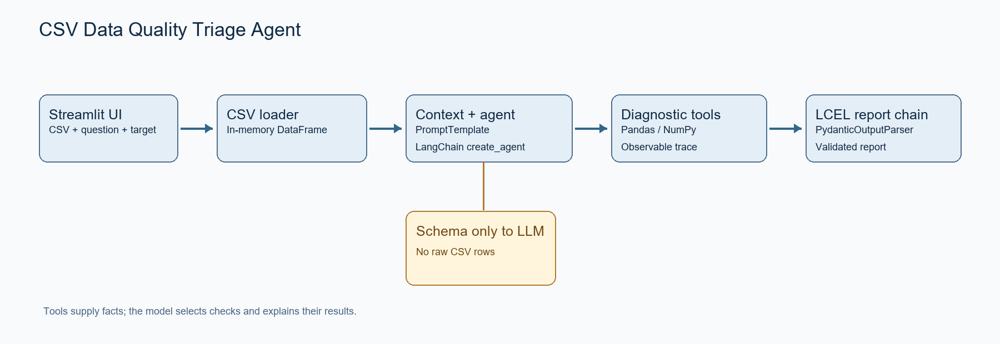

# CSV Data Quality Triage Agent

A Streamlit app that helps investigate CSV data problems before model training. Ask a question about a dataset; a LangChain agent selects relevant diagnostics, Python computes the statistics, and a separate reporting chain turns the results into an evidence-backed report.

This is a Phase 2 academic project. It runs locally and uses Groq-hosted `openai/gpt-oss-120b` by default.

## What it does

- Uploads and validates a CSV, then shows its shape, column types, missing counts, and preview.
- Accepts a natural-language question and an optional target column.
- Lets a LangChain agent choose from eight deterministic diagnostic tools, subject to a call limit.
- Shows each tool call, its status, arguments, summary, and computed evidence.
- Produces a structured report with severity, evidence, potential impact, recommendations, source tools, and limitations. Report issues must match tool findings.



The screenshot above is from a live run on `corrupted_outliers_corr.csv`. For “Do the numerical features contain suspicious values or relationships?”, the agent called `outlier_check` and `correlation_check`. See the [report screenshot](docs/screenshots/03_structured_report.png) and [full screenshot list](docs/SCREENSHOT_CHECKLIST.md).

## Quick start

Python 3.11+ and a [Groq API key](https://console.groq.com/keys) are needed for agent runs. The dataset preview works without a key.

From the repository root in **PowerShell**:

```powershell
py -3.11 -m venv .venv
.\.venv\Scripts\python.exe -m pip install -r requirements.txt
if (-not (Test-Path .env)) { Copy-Item .env.example .env }
```

Edit the root `.env` file and set:

```env
LLM_PROVIDER=groq
LLM_MODEL=openai/gpt-oss-120b
GROQ_API_KEY=<your-Groq-key>
```

Then run:

```powershell
.\.venv\Scripts\python.exe -m streamlit run app.py
```

Open the local URL printed by Streamlit. `.env` is Git-ignored; never put a real key in `.env.example` or a commit. Restart Streamlit after changing `.env`.

On macOS or Linux, create a virtual environment with `python3 -m venv .venv`, install with `.venv/bin/python -m pip install -r requirements.txt`, and run with `.venv/bin/python -m streamlit run app.py`.

## Try the sample datasets

| Upload | Target | Question | Expected diagnostic focus |
| --- | --- | --- | --- |
| `data/samples/corrupted_missing_duplicates.csv` | None | `Does this CSV contain missing data?` | Missing values |
| `data/samples/corrupted_class_imbalance.csv` | `label` | `Is my target distribution a problem?` | Class imbalance |
| `data/samples/corrupted_outliers_corr.csv` | None | `Do the numerical features contain suspicious values or relationships?` | Outliers and correlation |
| `data/samples/invalid_header_only.csv` | None | No question needed | Friendly CSV validation error |

For a broader investigation, ask `Why could this dataset cause problems during model training?` after uploading `corrupted_missing_duplicates.csv`. Tool choices and wording can vary between model runs; the diagnostic statistics come from Python tools. [Five observed live Groq scenarios](docs/LIVE_GROQ_VALIDATION.md) are documented separately.

## How it works



`CSV upload → loader and in-memory DataFrame → compact schema context → LangChain agent → selected diagnostics → tool trace → LCEL report chain → Pydantic parser → Streamlit report`

The full CSV stays in the local Streamlit process. The model receives the question, schema context, and aggregate diagnostic observations. It does not receive raw row samples in the prompt. The report validator rejects issues that lack an exact supporting tool finding.

| LangChain component | Location |
| --- | --- |
| `ChatPromptTemplate` | `src/agent/prompt.py` |
| `create_agent` and model factory | `src/agent/factory.py` |
| `StructuredTool` wrappers | `src/agent/tools.py` |
| LCEL report chain and `PydanticOutputParser` | `src/agent/report_chain.py` |

The tools cover dataset profile, missing values, exact duplicates, constant or near-constant columns, high-cardinality categorical or identifier-like columns, IQR outliers, selected-target class imbalance, and high absolute Pearson correlation. They report candidates for review; they do not automatically edit data or prove a causal training problem.

Groq is the default provider. The model factory also supports Mistral and OpenAI through `LLM_PROVIDER`, `LLM_MODEL`, and the corresponding provider API key.

## Tests and evidence

```powershell
.\.venv\Scripts\python.exe -m pytest -q
.\.venv\Scripts\python.exe -m compileall -q app.py src scripts tests
```

The latest local run passed **22 tests**. Unit tests cover CSV validation and diagnostics; integration tests exercise the LangChain agent, tool selection, trace collection, and report validation with a scripted model, without API calls. Separate live Groq runs and one Streamlit UI run are recorded in [live validation](docs/LIVE_GROQ_VALIDATION.md) and [Phase 2 progress](docs/PHASE2_PROGRESS.md).

The [Phase 2 submission update](docs/PHASE2_SUBMISSION_TEMPLATE.md) links the captured screenshots and lists remaining submission decisions. Source assignment documents and detailed design notes are under `docs/`.

## Current limits

- Intended for small and medium educational CSVs; upload size defaults to 20 MB.
- CSV decoding supports UTF-8 and Windows-1252.
- Class imbalance needs a selected categorical target.
- Outliers, duplicate rows, and strong correlation require context before changing data. Correlation alone does not establish leakage.
- The app does not clean datasets or train models. A Groq key is required for live agent orchestration.

## Troubleshooting

- **Run Triage is disabled:** confirm `GROQ_API_KEY` is in the root `.env` and restart Streamlit.
- **CSV is rejected:** use a `.csv` with a header, at least one data row, and consistent field counts.
- **Imbalance check is skipped:** select a suitable target in the sidebar.
- **Model or parser error:** inspect the visible tool trace and error message; verify the provider, key, and tool-capable model.
