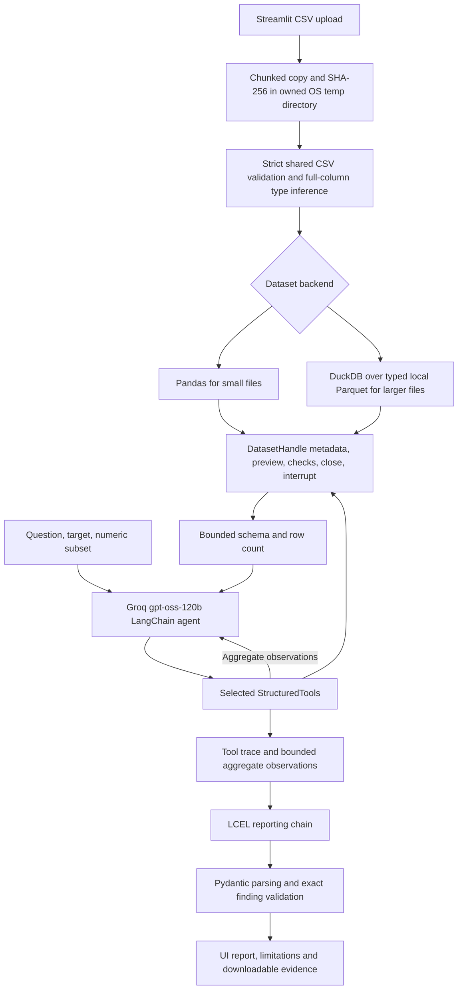

# Architecture

Implemented Phase 3 architecture, reviewed 1 October 2026. The original Phase 2 diagram remains in `docs/assets/csv_agent_architecture.png` as historical evidence.

**Figure 1.** Local dataset access, selective LLM/tool interaction and validated reporting. The editable source is [phase3_architecture.svg](assets/phase3_architecture.svg); `scripts/build_phase3_report.py` regenerates both image formats.

## Runtime flow

The user chooses a question and optional target/subset. The agent selects relevant checks; ingestion computes only necessary metadata. It does not automatically run all eight diagnostics.

## Code and responsibilities

| Component | Code | Responsibility |
| --- | --- | --- |
| Upload and session UI | `app.py` | File changes, preview, target/subset controls, background jobs, reset, report/trace/evidence |
| Owned temporary storage | `src/data/upload_store.py` | Bounded copy/hash, quota, safe cleanup and abandoned-session policy |
| Shared CSV contract | `src/data/csv_contract.py` | Strict fields/header/encoding/null policy; full-column types; leading-zero preservation |
| Backend selection | `src/data/loader.py` | Route by size; normalize once; return an owned handle; clean failed imports |
| Dataset interface | `src/data/dataset.py` | Metadata, bounded preview, exact check dispatch, interruption and close |
| Reference backend | `src/data/backends/pandas_backend.py` | Existing deterministic diagnostics, shared guards, cache and provenance |
| Disk backend | `src/data/backends/duckdb_backend.py` | Typed Parquet, SQL aggregates, finite statistics, resource guards, owned query interruption |
| Context and agent | `src/data/context_builder.py`, `src/agent/factory.py`, `src/agent/prompt.py` | Schema context and PromptTemplate; Groq model; actual `create_agent` graph |
| Tools and trace | `src/agent/tools.py`, `src/services/trace.py` | Execution/attempt/output budgets; bounded observations; full local results; actual status/coverage |
| Report | `src/agent/report_chain.py`, `src/models/schemas.py` | LCEL, Pydantic, one repair attempt, exact issue matching and deterministic summary/limits |
| Service/jobs | `src/services/triage_service.py`, `src/services/jobs.py` | Isolated request, metadata, heavy-job admission, cancellation lifecycle |

## Data and privacy boundaries

- CSV content, Parquet files and row previews remain local.
- The provider receives the question, schema/types, shape, target/subset and selected aggregate observations.
- Class-label distributions can contain raw categorical labels; these aggregate summaries can still be sensitive. Very long labels are guarded.
- A Groq key belongs in the ignored root `.env` as `GROQ_API_KEY`. It is not sent in evidence or committed.
- The trace shows observable calls, arguments, status, aggregate evidence, exactness, cache use and coverage. It does not reveal model reasoning.

## Exactness and resource scope

All eight checks use exact deterministic computations by default: profile, missing, full-row duplicates, constants, cardinality, finite IQR outliers, selected-target imbalance and finite pairwise Pearson correlation. No hidden sampling or approximate replacement occurs.

DuckDB's configured memory limit is an engine setting, not a complete process RSS guarantee. Numeric scope defaults to 20 columns, duplicates to 50 total columns, and exact quartile allocation has a conservative guard. Coverage distinguishes eligible-but-unchecked columns from categorical columns that do not apply to a numeric check. A selected subset is disclosed.

The uploader itself retains a Streamlit in-memory buffer. Disk-backed diagnostics reduce subsequent memory needs but do not make the entire upload stream out of core. See [measured results](PHASE3_RESULTS.md) for the actual release envelope, import budget and measurement boundaries.

## Failure and lifecycle paths

| Condition | Observed handling |
| --- | --- |
| Invalid CSV | Import fails before triage; owned temporary files are cleaned |
| Missing/unsuitable target | No unsupported imbalance result; skipped response and target limitation |
| Tool exception | Safe error status/summary in trace; report includes limitation and no invented issue |
| Scope/resource limit | Explicit skip/error and eligible coverage; no full-scan claim |
| Provider failure/throttling | Triage error; local handle remains available for a new run |
| Unsupported report | Exact issue validation; one repair attempt; readable failure with trace retained |
| Cancel | Event plus owned query interrupt; wait for active work before cleanup |
| Reset or new upload | Close prior handle; invalidate report/results; remove owned storage |

`BackgroundJob` admits one active heavy job and owns its worker. Query/import watchers are joined. Long provider requests are bounded by client timeouts; cancelling the UI does not imply that a remote provider has already stopped processing a request.

## Validation sources

- `tests/unit/test_duckdb_backend.py`: all-check parity, adversarial values, actual query/import interruption, guards, coverage and cache.
- `tests/integration/test_dataset_pipeline.py`: both handles through the actual LangChain graph with scripted model output and evidence validation.
- `docs/evaluation/phase3/scenarios/`: live/scripted attempts and controlled failure injection.
- `docs/evaluation/phase3/benchmarks/`: reproducible size/shape results, resource measurements and original failed attempts.
