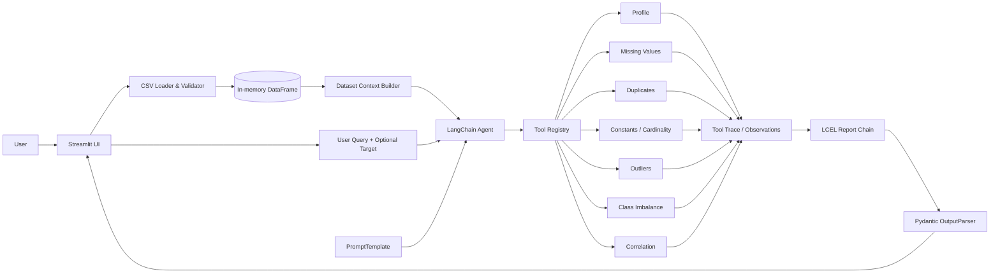
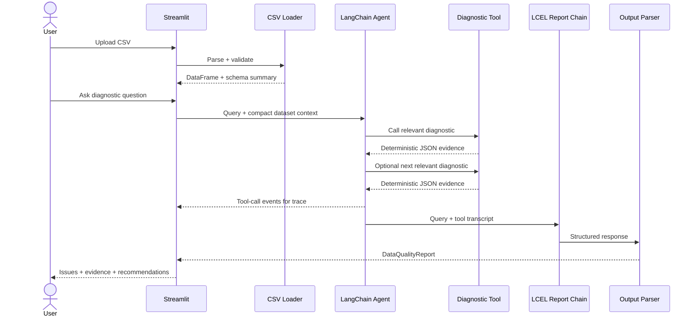

# Architecture
## CSV Data Quality Triage Agent

---

## 1. Logical Architecture

---

## 2. Runtime Sequence

---

## 3. Component Responsibilities

### Streamlit UI
- file upload,
- target selection,
- query input,
- dataset preview,
- agent execution button,
- tool trace,
- structured report.

### CSV Loader
- parsing,
- encoding handling,
- empty-file validation,
- column normalization policy,
- safe error messages.

### Dataset Context Builder
Creates a compact prompt-safe summary instead of sending the entire dataset.

### Agent
- interprets the user goal,
- chooses tools,
- sequences calls,
- respects tool-call limits,
- does not compute statistics itself.

### Tool Registry
Central list of allowlisted diagnostic functions exposed to LangChain.

### Diagnostic Layer
Pure deterministic Python/Pandas functions. This is the factual source of evidence.

### Trace Collector
Captures observable tool events for UI display and debugging.

### Reporting LCEL Chain
Transforms the user query and tool observations into a concise diagnosis.

### Output Parser
Validates final structure against Pydantic models.

---

## 4. Data Boundaries

The raw DataFrame should stay inside the application process.

The LLM should receive only:
- schema,
- column types,
- row/column counts,
- optional target name,
- compact aggregated tool outputs,
- user question.

Avoid inserting:
- the entire CSV,
- large raw row samples,
- secrets,
- API keys.

---

## 5. Failure Paths

### Invalid CSV
UI → Loader error → readable user message.

### Missing target for target-specific request
Agent/tool → `skipped` response → report limitation.

### Diagnostic tool exception
Tool → structured `error` result → trace → report notes limitation.

### LLM/API failure
Agent service → UI error + retry suggestion; local dataset remains loaded.

### Invalid final JSON
Output parser → one repair attempt → raw fallback for debugging if still invalid.

---

## 6. Implemented Runtime Details

- `src/agent/factory.py` constructs a Groq, Mistral, or OpenAI LangChain chat model and a `create_agent` graph. Groq's `openai/gpt-oss-120b` is the default. `ChatPromptTemplate` renders the agent's system prompt from schema context, selected target, tool descriptions, and call budget.
- `src/agent/tools.py` creates an isolated set of `StructuredTool` closures for each run. Each closure accesses the current in-memory DataFrame and records its own deterministic result. No DataFrame is serialized into a tool argument.
- `src/services/trace.py` records observable calls with a lock, so parallel tool requests respect the diagnostic budget. Failed, repeated, and over-budget calls are visible as `error` or `skipped` events.
- `src/agent/report_chain.py` implements `REPORT_PROMPT | model | StrOutputParser()` followed by `PydanticOutputParser`. Every issue must exactly match an observed deterministic finding. Invalid output gets one retry, then the UI receives a readable error and raw report text for debugging.
- The architecture PNG was generated from this implemented flow because the supplied source folder did not contain the referenced image.
