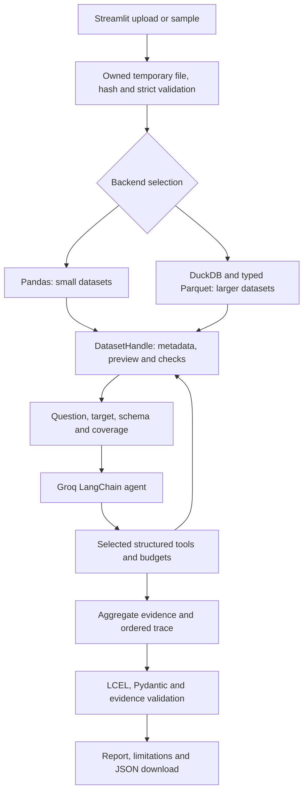

# Phase 3 implementation and completion record

**Status: implementation and benchmark work completed on 1 October 2026.** The release supports the confirmed **250 MB local target** within the measured workload and explicit diagnostic guards below. The UI label MB means MiB here: the limit is **262,144,000 bytes**. The final browser evidence is maintained in [UI validation](evaluation/phase3/ui/UI_VALIDATION.md). The demonstration video, author-confirmed contribution statements, and course submission steps remain student actions.

Companion documents:

- [6:30 demo script](PHASE3_DEMO_SCRIPT.md)
- [Evaluation, screenshot procedures and submission checklist](PHASE3_EVALUATION_AND_SUBMISSION.md)
- [Original Lab 9 brief](source/Lab%209_2026_27.docx), Activity 2 and Phase 3 Submission
- [Phase 1 proposal](source/I024_I029_GAI%20Assignment%202_Phase1.pdf)
- [Implementation log](PHASE3_WORK_LOG.md)

## 1. Assignment requirements and deliverables

The project is **Activity 2: Tool-Augmented/Agentic LLM Application**. Lab 9 requires at least three appropriate LangChain components; this implementation uses prompt templates, an agent with structured tools, LCEL, and a Pydantic output parser. Conversational memory and RAG are not necessary for this use case.

| Requirement | Actual deliverable / remaining action |
| --- | --- |
| Working notebook or repository, README | Working Streamlit repository with setup, configuration, limits and commands |
| Architecture and LLM–tool interaction | [Final architecture](ARCHITECTURE.md) and [PNG](assets/phase3_architecture.png) |
| Sample inputs/outputs and test results | Small tracked fixtures, original trace/report exports and [test results](evaluation/phase3/test_results.txt) |
| At least five evaluation scenarios | Nine live Groq scenarios with actual outputs, including skipped and failed tools |
| One failed or unexpected tool response | Unsuitable-target skip and explicitly labeled controlled duplicate-tool exception |
| 5–7 minute video with two live cases | [6:30 script](PHASE3_DEMO_SCRIPT.md); the students must record and check the video |
| 3–4 page technical report | Final saved report and render/page-count evidence belong to the submission package; verify the delivered PDF |
| Individual contribution statements | [Author-review templates](../submission/Contribution_Statements.md); students must complete actual work and confirm |
| Feedback form | Obtain the real instructor form/link and submit it |

The rubric assigns 1 mark to problem/architecture, 2 to LangChain integration, 2 to implementation, 2 to evaluation/problem solving, and 1 each to demonstration, reflection and contribution.

The brief lists **30 September 2026**, before the work date of 1 October. It also mentions both three- and four-person groups, while the proposal names two students. Confirm late/revised submission instructions, the accepted roster, actual instructor feedback, and the feedback form. No extension, extra contributor or feedback has been assumed.

## 2. Preserved foundation and implemented changes

The Phase 2 baseline passed 22 tests before implementation. Historical Phase 2 screenshots and live validation remain unchanged. The final Phase 3 run passed **122 tests in 12.29 seconds**; dependency and compilation checks are also recorded in [test_results.txt](evaluation/phase3/test_results.txt). Scripted tests and live provider evidence are recorded separately.

Preserved: eight diagnostic definitions and thresholds, selective agent tool use, contextual recommendations, exact issue evidence validation, a bounded report repair, visible trace, target requirements, and stale-report clearing.

Implemented:

- A `DatasetHandle` boundary with Pandas for small files and DuckDB/Parquet for larger files. Auto selects Pandas through 20 MiB, DuckDB above that threshold. The UI permits an explicit backend for the next import.
- One chunked copy/hash on changed uploads; per-session generated temporary paths outside the project; bounded preview and cached basic metadata. The app no longer hashes `upload.getvalue()` and recomputes full uniqueness on every rerun.
- Shared strict field counts, encoding/header/null rules, full-column type inference, preserved leading-zero identifiers, and textual fallback for mixed columns. Invalid values are not silently dropped or converted into missing data.
- All eight exact diagnostic adapters, local aggregate caching, execution provenance, coverage guards, bounded model observations and tool attempts.
- Background import/triage, actual-stage progress, cancellation/interruption, one active heavy operation, reset/replacement cleanup and conservative abandoned-directory cleanup.
- A report summary grounded in validated findings; failed/skipped/bounded checks are disclosed as limitations. The report retains its original question and selected target.
- `Download run evidence (JSON)` with the original report, trace and run metadata; deterministic generator, benchmarks, evaluation harness and fresh computer-use evidence.

## 3. Shipped architecture and file map

| Location | Implemented responsibility |
| --- | --- |
| `src/data/dataset.py` | Dataset protocol and legacy DataFrame adaptation |
| `src/data/upload_store.py` | Chunked hashing/copy, owned storage, quotas and cleanup |
| `src/data/csv_contract.py`, `src/data/loader.py` | Shared strict semantics and backend routing |
| `src/data/backends/pandas_backend.py` | Reference diagnostics, cache and bounded coverage |
| `src/data/backends/duckdb_backend.py` | Typed Parquet, exact SQL checks, spill/resource guards and interruption |
| `src/agent/tools.py`, `src/data/context_builder.py` | Selective tool execution, bounded context/results and trace metadata |
| `src/agent/report_chain.py` | LCEL output parsing, supported findings, deterministic grounding and limitations |
| `src/services/triage_service.py`, `jobs.py`, `evidence.py` | Run orchestration, cancellation/background execution and exports |
| `app.py`, `src/ui/components.py` | Backend/target/subset controls, progress, evidence and downloads |
| `scripts/generate_benchmarks.py`, `benchmark_phase3.py`, `evaluate_phase3.py` | Reproducible fixtures, actual resource measurements and scenario evidence |

Raw CSV rows stay local. Column schema and selected aggregate observations go to Groq `openai/gpt-oss-120b`; those can still contain sensitive information. The key belongs only in ignored root `.env` as `GROQ_API_KEY`.

## 4. Exact checks and explicit scope

| Check | Behavior and boundary |
| --- | --- |
| Profile | Exact shape/nulls and requested distinct counts; bounded displayed schema, target included, omissions stated |
| Missing values | Exact per-column null counts; existing 5%/30% severity thresholds |
| Duplicates | Full-row equality including null semantics, count = rows − distinct rows; **skipped above 50 total columns** |
| Constant / near-constant | Exact grouping including null category; 95% dominant threshold |
| High cardinality | Exact non-null distinct ratios for categorical or identifier-named columns; continuous numeric values are not automatically flagged |
| Outliers | Exact finite-value Type 7 quartiles and IQR counts; numeric scope and estimated aggregate-memory guards |
| Class imbalance | Exact selected-target counts; categorical/class-count guards; missing or unsuitable target explicitly disclosed |
| Correlation | Exact pairwise finite Pearson statistics, excluding selected target; at most 20 numeric columns unless the user supplies a bounded subset |

Wide files can be loaded and previewed, while particular checks remain unassessed. A skip is not an exact statistic or proof that no problem exists. No sampling or approximate substitute is silently used. Findings retain contextual recommendations: outliers and duplicates can be legitimate; correlation alone does not prove leakage.

## 5. Resource settings and revised import gate

| Setting / acceptance budget | Release value |
| --- | --- |
| Upload ceiling | 250 MiB = 262,144,000 bytes |
| Auto Pandas threshold | 20 MiB |
| DuckDB memory setting | `1GB`; this is an engine setting, not an RSS guarantee |
| DuckDB threads | 2 |
| Spill / session temporary-storage allowance | 2 GiB / 4 GiB |
| Sampled process + worker RSS gate | 2 GiB |
| Full local import wall-time gate | **120 seconds** |
| Original import goal | 60 seconds; misses and original failures retained |
| Simple requested check | 30 seconds |
| Duplicate / exact outlier check | 120 seconds |
| Local diagnostic time per triage | 180 seconds; API latency separate |
| Executed checks / attempted tool events | 6 / 12 |
| Numeric scope / schema / findings / observation | 20 / 50 / 20 / 16 KiB, with omissions disclosed |

The initial 60-second validation allowance rejected six 250 MiB tall imports. A numeric parsing fast path improved throughput, but the initial time goal remained unreliable. The release import allowance was explicitly revised to 120 seconds, retaining `initial_60s_goal_pass`, the original failed records, and a separate release-limit field. It is not reported as having met the original goal.

Streamlit keeps an in-memory uploaded-file buffer, so disk-backed diagnostics do not make the entire upload out of core. Actual browser upload evidence and CLI measurements are separate. [Streamlit uploader](https://docs.streamlit.io/develop/api-reference/widgets/st.file_uploader)

DuckDB can spill several operations, but memory settings and spill support do not guarantee all workloads fit. Exact aggregate guards and measured RSS remain necessary. [DuckDB workload tuning](https://duckdb.org/docs/current/guides/performance/how_to_tune_workloads), [aggregate reference](https://duckdb.org/docs/current/sql/functions/aggregates)

## 6. Measured acceptance evidence

Environment: Windows, Python 3.11.4, about 16 GiB physical memory, DuckDB 1.5.0, Pandas 2.3.3. Full package/hardware/source snapshots are in [benchmark manifest](evaluation/phase3/benchmarks/benchmark_manifest.json). The working tree was modified during measurement; commit references and source hashes are retained rather than presented as a clean release commit.

The tall numeric ladder used 1/20/50/100/250 MiB, with three required independent imports per size. Four additional 250 MiB profiles test cardinality, nulls, quoting/Unicode/newlines, and width. All generated files stop at a complete record below the configured byte ceiling. Ground truth derives from construction, not the application under test.

| 250 MiB profile | Max successful import seconds, all saved attempts | Max sampled harness RSS MiB | Observed scope |
| --- | --- | --- | --- |
| Tall numeric | 93.338 | 824.4 | Exact null/duplicate/class invariants; all eight checks executed in additional risk run |
| High-unique strings | 41.804 | 730.2 | Exact null/duplicate/class invariants; all eight checks executed in additional risk run |
| Null-heavy | 96.977 | 1,076.0 | Exact null/duplicate/class invariants |
| Quoted Unicode / multiline | 23.616 | 1,002.4 | Exact null/duplicate/class invariants |
| Wide, 202 columns | 78.977 | 959.2 | Exact null/classes; duplicate guard verified, exact duplicate count unassessed |

There are **38 timed import attempts: 32 successful and six initial validation timeouts**, with 112 recorded diagnostic rows. The successful counts include extra repeated imports and two all-eight-check risk runs. Required revised-release imports passed 3/3 per 250 MiB profile. Unknown large statistical truth is not counted as a correctness pass: constants/cardinality/outliers/correlation were exercised successfully, while independent numerical parity is established on small controlled fixtures.

Use [verified CSV](evaluation/phase3/benchmarks/benchmark_results_verified.csv) and [verification audit](evaluation/phase3/benchmarks/benchmark_verification_audit.json) to distinguish expected wide guards from an earlier harness expectation that marked a duplicate skip false. The original CSV and JSON remain unchanged. [Verified summary](evaluation/phase3/benchmarks/benchmark_verified_summary.md)

CLI RSS includes the harness process and recursive children, **excludes browser and Streamlit upload buffers**, and is sampled rather than a hard process limit. Temporary files were sampled every 50 ms in an isolated owned root. OS filesystem cache and other desktop load were uncontrolled; independent imports are not claimed disk-cold. API/report timing is excluded from these local benchmarks.

The separate actual Streamlit 250 MiB upload also passed: **36.093 seconds local import wall time**, 3,274,752 rows, DuckDB, and **1,312.97 MiB sampled server RSS including its uploader buffer**. Browser process memory remains excluded. The live missing-value run took about 3.938 seconds and returned 327,476 missing values in `nullable` (10%). Original exports and sampler output are in [large_evidence.json](evaluation/phase3/ui/large_evidence.json) and [large_upload_resources.json](evaluation/phase3/ui/large_upload_resources.json). Upload transfer time and the CLI/import timings are not interchangeable.

## 7. Live evaluation and remaining submission work

Nine live Groq scenarios have successful recorded attempts, including the controlled failed duplicate tool and the unsuitable-target skip. Earlier failures and retries remain recorded; one retry captured a real **429 tokens-per-minute limit**, followed by an isolated successful retry. Scripted graph tests prove repeatable integration behavior, not provider availability. [Scenario records](evaluation/phase3/scenarios/scenario_results.md)

Implementation, automated validation, local benchmarks, fresh live traces, actual architecture, and evidence export are complete. The final saved browser record controls claims about screenshots and actual upload-buffer measurements. Before submission the students must:

1. Record and verify the 5–7 minute video using the 6:30 script and two actual live cases.
2. Complete and confirm truthful individual contribution statements, including AI/tool assistance.
3. Confirm the instructor's roster/deadline instructions, incorporate any real feedback, and submit the actual feedback form.
4. Verify the final report is 3–4 pages, the repository/evidence links work, and the instructor can access the video and package.

Future engineering improvements are a genuine streaming upload service, a broader hardware/workload benchmark, and multi-user process-level resource isolation. Automatic cleaning, model training, Spark and cloud deployment remain outside this phase.

## LLM synthesis revision - 1 October 2026

The current report preserves an LLM-written summary, source-linked interpretation and suggested next steps. Brief tool-choice explanations appear in progress and beside trace entries. Verified findings and deterministic scope/limitations remain separate. **149 tests passed in 10.31s**; fresh Groq runs and captures 11-13 are documented in [synthesis validation](evaluation/phase3/llm_synthesis/README.md). The 122-test run, original screenshots, live attempts and size measurements above describe the prior release and remain preserved. The current 6:30 demo script demonstrates a no-finding 60/40 target distribution with a useful explanation. No benchmark rerun is claimed.
