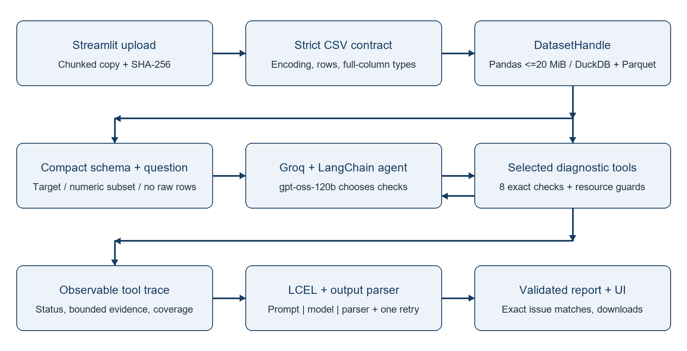

# CSV Data Quality Triage Agent

Lab 9 - Activity 2 | Phase 3 technical report | 1 October 2026

## 1. Problem and implemented workflow

CSV defects can distort machine-learning preparation. The application answers a user's diagnostic question using selected deterministic checks, with evidence and contextual recommendations. It does not clean datasets or train models. The local release upload limit is 250 MiB (MiB = 1,048,576 bytes); supported shapes and measured boundaries are reported on page 4.

Figure 1. Implemented selective tool workflow.

## LangChain components and external API

| Component | Implemented role |
| --- | --- |
| ChatPromptTemplate | Agent instructions include question, schema, target, allowed tools and budgets. |
| Agent + StructuredTool | create_agent asks Groq openai/gpt-oss-120b to select from eight checks. |
| LCEL chain | REPORT_PROMPT / model / StrOutputParser produces candidate report JSON. |
| PydanticOutputParser | Validates report shape; issue fields must exactly match emitted tool findings; one repair attempt. |

The Groq API is accessed through langchain-groq using an ignored root .env key. Raw datasets and row previews stay local. Schema, questions, aggregate evidence and categorical class labels can reach the provider; these summaries can still contain sensitive information. Observable tool events are displayed; model reasoning is not recorded.

<!-- page break -->

## 2. Implementation and exact diagnostics

The uploader is copied and hashed in chunks once. Strict validation handles UTF-8/BOM and Windows-1252, rejects inconsistent fields and empty headers, numbers duplicate names, preserves leading-zero identifiers, and examines complete columns before type selection. Both engines share this contract. Small files use the Pandas reference; larger files use DuckDB and typed Parquet in an app-owned OS temporary directory.

| Diagnostic | Evidence and correctness rule |
| --- | --- |
| Profile | Rows/types/nulls and exact distinct counts; at most 50 visible columns with the selected target retained. |
| Missing | Exact null counts and percentages; existing 5%/30% severity thresholds. |
| Duplicates | Rows minus distinct complete rows; nulls equal; context required before removal. |
| Constants | Distinct categories include null; near-constant dominant fraction at least 95%. |
| Cardinality | Eligible categorical or identifier-named columns; at least 20 observations and 90% unique ratio. |
| Outliers | Finite numeric values, exact Type-7 quartiles and 1.5 x IQR bounds; at least four observations. |
| Imbalance | Selected target; exact class counts; ratio 3/9 thresholds; unsuitable/long-label targets skipped. |
| Correlation | Exact finite pairwise Pearson r; target excluded; /r/ at least 0.95; does not establish leakage. |

## Execution controls and evidence integrity

An owned background job admits one heavy operation. DuckDB uses a 1 GB memory setting, two threads and 2 GiB spill allowance; the session storage quota is 4 GiB. Query cancellation interrupts the connection and waits for active work before cleanup. Reset, replacement and failed import close handles; abandoned storage cleanup checks ownership. Memory settings do not guarantee whole-process RSS.

Numeric scans require at most 20 selected columns; full-row duplicates are guarded above 50 columns. Exact quartiles use one shared aggregate state plus a conservative allocation check. A resource-limited operation is skipped or fails visibly; it never silently samples. Six executed checks, twelve attempted events, twenty emitted findings and a 16 KiB observation cap bound orchestration. Full local evidence is separately downloadable.

Every issue is matched to the transmitted finding's tool, type, severity, column, evidence, impact and recommendation. Missing supported findings are restored. Summary and limitations are rebuilt from observed checks, errors and coverage. Deterministic caches include dataset, selected scope and thresholds; cache hits are disclosed.

<!-- page break -->

## 3. Evaluation and failure handling

The current verified automated suite contains 122 passing tests. It includes backend parity, quoting/null/infinity/leading-zero cases, actual long-query interruption, import cancellation, cleanup and cache invalidation, and scripted full LangChain graph tests for both handles. Scripted tests establish wiring and evidence enforcement; live scenarios below measure real Groq behavior. Original attempts and retries remain saved.

| ID / case | Latest result | Actual evidence / elapsed |
| --- | --- | --- |
| T01 Missing values | pass | missing_values_check; 3.09 s |
| T02 Broad quality | pass | missing_values_check, constant_columns_check, duplicate_rows_check; 52.43 s |
| T03 Target imbalance | pass | class_imbalance_check; 12.53 s |
| T04 Outlier/correlation | pass | outlier_check, correlation_check; 38.40 s |
| T05 Unsuitable target | pass | class_imbalance_check; 4.33 s |
| T06 Injected tool failure | pass | duplicate_rows_check, duplicate_rows_check, duplicate_rows_check, duplicate_rows_check; 7.69 s |
| T07 No target selected | pass | No tool calls; 11.16 s |
| T08 Clean missing check | pass | missing_values_check; 15.96 s |
| T09 Header-only upload | pass | No tool calls; 0.02 s |

## Observed challenge and controlled failure

Early live attempts included retained triage errors, repeated diagnostic calls in the controlled-failure case, and provider throttling. Automated adversarial tests separately confirm that unsupported report issues are rejected after a repair retry. Supported findings and limitations are preserved deterministically. Provider HTTP 429 is retained as a real external failure rather than counted as a passing tool-selection case. Latest per-case results appear above; history remains in the scenario index.

T06 deliberately replaces only the duplicate diagnostic in the evaluation harness with an exception. This is controlled failure injection with live orchestration, not an organic dataset defect. Its trace records error, the report includes a limitation, and no duplicate count is invented. T05 uses record_id as an unsuitable target and should return a visible skipped check. Invalid uploads stop before triage; a missing target yields a target-selection limitation.

Evidence: docs/evaluation/phase3/scenarios/*_result.json records hashes, prompts, target, provider/model, calls, status and latency; companion trace/report JSON records observations. scenario_results.md retains attempt history. T09 stops during input validation and makes no provider request even though it belongs to the live-mode harness. Unit and integration files provide API-free reproduction.

<!-- page break -->

## 4. Measured scaling, limits and submission

The generator provides independent construction-based null, duplicate and class-count manifests. Latest attempts per profile/size/repeat show slowest import and peak RSS/storage below. Pass means verified counts/shape and resource gates, not independent verification of every large-file statistic. Guarded means expected skips with those statistics unassessed. OS caching is uncontrolled. The diagnostic harness excludes browser/uploader and API calls.

| Profile / MiB | Runs | Max import s | Peak RSS MiB | Peak temp MiB | Gate |
| --- | --- | --- | --- | --- | --- |
| tall numeric / 1 | 3 | 0.27 | 110.0 | 2.0 | pass |
| tall numeric / 20 | 3 | 3.52 | 158.8 | 42.9 | pass |
| tall numeric / 50 | 3 | 11.07 | 240.7 | 105.4 | pass |
| tall numeric / 100 | 3 | 21.47 | 353.2 | 214.8 | pass |
| high unique strings / 250 | 3 | 36.61 | 730.2 | 506.0 | pass |
| null heavy / 250 | 3 | 96.98 | 1076.0 | 574.9 | pass |
| quoted unicode / 250 | 3 | 23.62 | 1002.4 | 528.0 | pass |
| tall numeric / 250 | 3 | 62.09 | 813.0 | 534.9 | pass |
| wide numeric / 250 | 3 | 78.98 | 959.2 | 564.9 | guarded |

Across the latest successful 250 MiB profiles, slowest measured selected-check times were class imbalance 0.15s; constant columns 1.33s; correlation 8.01s; dataset profile 1.22s; duplicate rows 2.06s; high cardinality 0.45s; missing values 0.00s; outlier 3.29s. These are diagnostic times; provider/report latency is measured separately in the live scenario table.

All eight diagnostics completed in the saved 250 MiB risk runs for high unique strings, tall numeric. Large-file constants, cardinality, outliers and correlation lack independent full-size statistical ground truth; successful execution is distinct from measured statistical correctness. Small-fixture backend parity provides separate evidence.

The initial 60-second full-validation goal failed on 250 MiB tall data; those failed attempts are preserved. The release import budget was revised to 120 seconds after observing the cost of strict full-column validation. Correctness, 2 GiB application/worker RSS and other declared gates are still required; changing the time budget is explicitly documented, not a claim that the initial goal passed.

Actual browser upload: 262,143,987 bytes, 3,274,752 rows and 13 columns loaded into DuckDB in 36.093s, excluding HTTP transfer. Sampled peak app/worker RSS was 1312.97 MiB including the Streamlit upload buffer; browser RSS was excluded. A live Groq missing-value run took 3.9375s. This is one desktop upload, not a concurrency test. Original downloaded evidence and resource record are in docs/evaluation/phase3/ui/.

Streamlit UploadedFile retains an in-memory buffer. Disk-backed analysis avoids full DataFrames and extra complete byte copies but is not an end-to-end streaming upload service. The demonstrated envelope concerns tested shapes, not every possible 250 MiB CSV. Wider schemas, huge labels, holistic quartile allocations, disk pressure and provider rate limits can lead to explicit skips/errors. Outliers, duplicates and correlations require domain interpretation.

## Reproducibility and remaining human deliverables

Reproduce using README commands, saved environment/source hashes, and scripts/build_phase3_report.py with the verified test count. The user records the planned 6:30 two-case video. Confirm individual statements, the real feedback form, roster and late-submission instructions; the brief's deadline was 30 September 2026.

## Sources

Assignment: docs/source/Lab 9_2026_27.docx (Activity 2, Phase 3 and rubric); Phase 1 proposal in docs/source. Technical references: docs.streamlit.io/develop/api-reference/widgets/st.file_uploader; duckdb.org/docs/current/guides/performance/how_to_tune_workloads; duckdb.org/docs/current/sql/functions/aggregates. Implementation, saved traces and benchmark manifests are the sources for measured claims.
